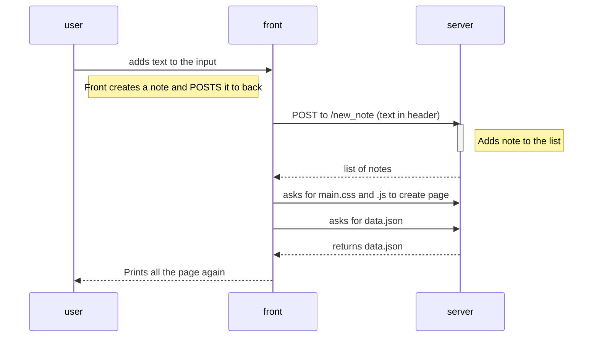
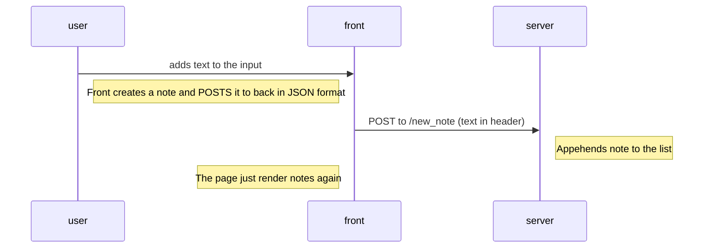

NO SPA

```mermaid
sequenceDiagram
participant user
participant front
participant server

user->>front: adds text to the input
Note left of front: Front creates a note and POSTS it to back
front->>server: POST to /new_note (text in header)
activate server
Note right of server: Adds note to the list
deactivate server
server-->>front: list of notes
front->>server:asks for main.css and .js to create page
front->>server: asks for data.json
server-->>front: returns data.json

front-->>user: Prints all the page again
 
```

SPA

```mermaid
sequenceDiagram
participant user
participant front
participant server

user->>front: adds text to the input
Note left of front: Front creates a note and POSTS it to back in JSON format
front->>server: POST to /new_note (text in header)
activate server
Note right of server: Appehends note to the list
Note left of front: The page just render notes again

 
```

